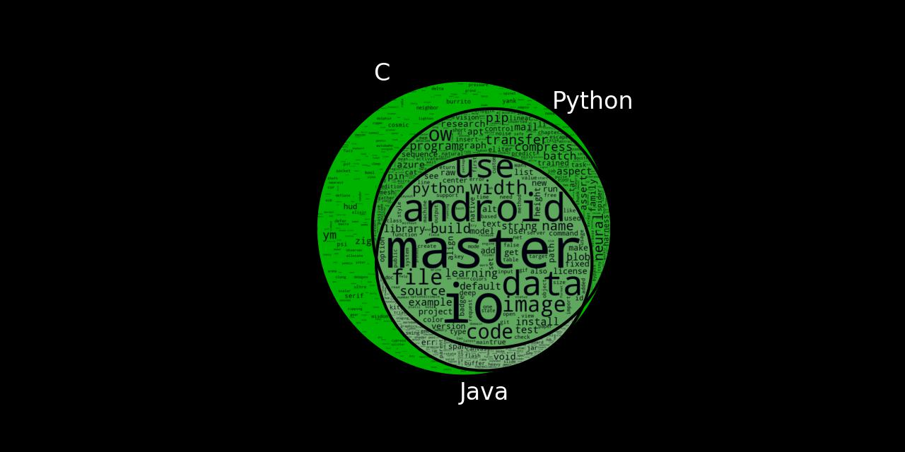

  

 

# **PREDICTING REPO PROGRAMMING LANGUAGE BY THE README**

  [`Video Presentation`](https://www.canva.com/design/DAFPZgy0ed8/zMVq3tYoLPYH2Pt_AWac2Q/view?utm_content=DA[…]campaign=designshare&utm_medium=link&utm_source=recording_view)
      
### *Richard Macken & Dan Churchill*
  

  [`  Project Description  `](#project_description)
  [`  Project Planning   `](#planning)
  [`  Data Dictionary  `](#dictionary)
    
  [`  Data Acquire and Prep  `](#wrangle)
  [`  Data Exploration   `](#explore)
  [`  Modeling   `](#model)
    
  [`  Conclusion   `](#conclusion)
  [`  Steps to Reproduce   `](#reproduce) 
  
 

  

 
## Project Description and Goals:
 
  The purpose of this project is to build a model that can predict the main programming language of a repository, given the text of the README file.

  > Goal 1: Generate a list of repositories programatically using web scraping techniques 
  > Goal 2: Prepare and Explore the natural language data that we have acquired 
  > Goal 3: Create three models to predict language of a repo, and select the best model to use against test data

  

  <a href='#top'>`⚓`</a>
  

  

  
  ***
## Project Planning: 
### Project Outline:
  - Acquire, clean, and prepare data from the Github Website using their API and a personal access token
      - Data was acquired Oct 17, 2022 from the top 150 results for three languages (C+, Python, Java) where the readme is in english
  - Split data and perform initial data exploration to determine what features will be usefull for modeling
  - Train multiple classification models and evaluate on train dataset
  - Choose the model with that performs the best and evaluate that single model on the test dataset
  

  [`⚓`](#top) 
  
 

***

## Data Dictionary

<blockquote> 
 
     
 | Target Attribute | Definition | Data Type |
  | ----- | ----- | ----- |
  | language | the primary programming language of the repository | string |

   
   
  

  | Feature | Definition | Data Type |
  | ----- | ----- | ----- |
  | repo | the user id/repo name | string |
  | readme_contents | the text from the readme file of the repo | string |
  | cleaned	 | the text of the readme file after intial cleaning | string |
  | stemmed | the text of the readme file after it has been stemmed | string |
  | lemmatized | the text of the readme file after it has been lemmatized | string |

  </blockquote>
 

  [`⚓`](#top) 
  

  ***
## Data Acquisition and Preparation
  Data is acquired from the Github website using a personal access token to scrape their website via their API.  The modular functions within the acquire.py file obtain the userdata, clean it to remove encoded characters and save that to another column, stem the words to remove suffixes and save it to it's own column, and then creates one last column of lemmatized data.  Prior to exploration the data is split into 60% train, 20% validate, and 20% test before exploration.

  [`⚓`](#top) 
  

***
## Data Exploration:
### Hypothesis
  The sets of words corresponding to C, Python and Java will have independent values.
  
### Unique Words
  The first step was to determine unique words in our corpus.  There was a total of 2383 unique "words" in the union of every language.  The total number of unique "words" in the intersection of every language was 1119.  When separated by language there were 675 words that were unique to C, while there were no words unique to Python or C. Therefore we find that our hypothesis is only true for C.
### TF/IDF
  Next TF and IDF were calculated for each word by language, and appended it to the dataframe.  We were able to explore this proportion graphically via chart
### Takaways Exploration:
  - We were able to identify frequency of terms in the corpus overall, and as a proportion by language, and identify the most common terms visually using wordclouds

  [`⚓`](#top) 
  

***
## Modeling:
#### Modeling Results
  | Model | Baseline/Train Accuracy | Validate Accuracy |
  | ---- | ---- | ---- | 
  | Baseline | 33% | N/A |
  | Logistic Regression | 95% | 75% | 
  | Random Forest | 100% | 72% |  
  | K-Nearest Neighbors | 75% | 75% | 
  - The K-Nearest Neighbors model had the most consistent performance
## Testing the Model
  - KNN model used on Test data
#### Testing Dataset
  | Model | Accuracy on Test | 
  | ---- | ---- | 
  | K-Nearest Neighbors | 75% |

  [`⚓`](#top) 
  

***
## Conclusion and Next Steps:
  - We created a model that was able to predict programming language of a repo with 75% accuracy
  - The efforts to thoroughly clean the text leaving only English words paid off in increased model performance
  - "android" was the most common word for Java
  - "learning" was the most common word for Python
  - "fixed" was the most common word for C+
  - Given more time we would have further explored N-grams to possibly improve performance

  [`⚓`](#top) 
  

  
*** 
## Steps to Reproduce:
  In order to reproduce the project follow the steps below:
  - Clone or download the entire repo and run the files prefixed with aquire, prepare,explore and modeling (all files in repo). 
  - Read the comments in the code as there are sections that need to be uncommented once to generate files.
  - Generate a personal access token at https://github.com/settings/tokens 
  - Add your own env.py file to the directory containing your own 'github_token and 'github_username
  - Run the final_repot.ipynb notebook

  [`⚓`](#top) 
  

